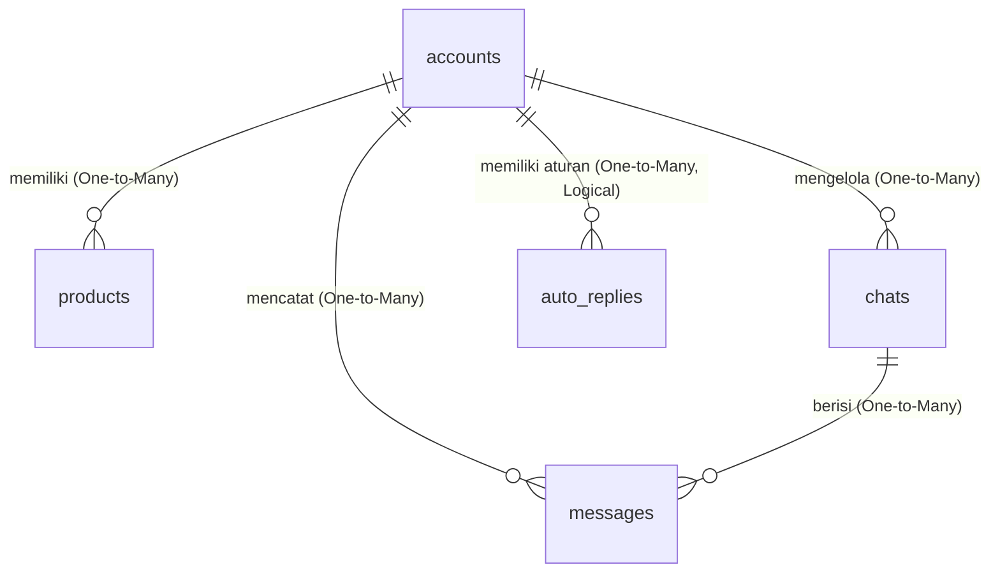

# Dokumentasi Database & Rencana Caching Jawaban AI

Dokumen ini menjelaskan struktur database Relasional (SQLite) yang digunakan pada **ReplyHub**, beserta rencana teknis untuk menambahkan sistem cache jawaban AI dari histori chat yang sudah ada.

---

## 1. Daftar File Database

Aplikasi menggunakan tiga file database SQLite terpisah yang terletak di folder data:
1. **`userdata.db`** (Lokasi: `src/data/user/`)
   * Menyimpan akun WhatsApp, data produk/katalog, serta log histori chat (percakapan & pesan).
2. **`chat_data.db`** (Lokasi: `src/data/chat_data/`)
   * Menyimpan aturan balasan otomatis berbasis kata kunci (*auto replies*).
3. **`theme.db`** (Lokasi: `src/data/theme/`)
   * Menyimpan konfigurasi tampilan tema aplikasi (light/dark).

---

## 2. Struktur Tabel & Entitas Database

### A. Database: `userdata.db`

#### 1. Tabel `accounts`
Menyimpan informasi akun WhatsApp yang terhubung serta pengaturan kecerdasan buatan (Gemini & Ollama) untuk masing-masing akun.

| Nama Kolom | Tipe Data | Deskripsi |
| :--- | :--- | :--- |
| `id` | `INTEGER` | Primary Key, Auto Increment. |
| `phone_number` | `TEXT` | Nomor telepon WhatsApp yang terhubung. |
| `push_name` | `TEXT` | Nama profil WhatsApp atau nama kustom akun. |
| `session_name` | `TEXT` | Nama sesi unik (digunakan sebagai nama file `.db` sesi neonize), **UNIQUE**. |
| `created_at` | `TIMESTAMP` | Waktu pendaftaran akun (default: `CURRENT_TIMESTAMP`). |
| `gemini_enabled` | `INTEGER` | Status aktif AI Gemini (`1` = Aktif, `0` = Nonaktif). |
| `gemini_api_key` | `TEXT` | API Key Google Gemini. |
| `gemini_model` | `TEXT` | Nama model Gemini yang digunakan (default: `gemini-1.5-flash`). |
| `gemini_instruction`| `TEXT` | Instruksi sistem / System Prompt untuk Gemini. |
| `ollama_enabled` | `INTEGER` | Status aktif AI Ollama (`1` = Aktif, `0` = Nonaktif). |
| `ollama_url` | `TEXT` | URL endpoint lokal Ollama (default: `http://localhost:11434`). |
| `ollama_model` | `TEXT` | Nama model Ollama (default: `qwen2.5:1.5b`). |
| `ollama_instruction`| `TEXT` | Instruksi sistem / System Prompt untuk Ollama. |

#### 2. Tabel `products`
Menyimpan katalog produk e-commerce yang diintegrasikan ke dalam instruksi AI sebagai basis pengetahuan produk.

| Nama Kolom | Tipe Data | Deskripsi |
| :--- | :--- | :--- |
| `id` | `INTEGER` | Primary Key, Auto Increment. |
| `account_id` | `INTEGER` | Foreign Key merujuk ke `accounts(id)`. |
| `name` | `TEXT` | Nama produk. |
| `price` | `TEXT` | Harga produk (contoh: "Rp99.000"). |
| `stock` | `TEXT` | Informasi stok dan varian (contoh: "Hitam M, L"). |
| `description` | `TEXT` | Deskripsi atau detail produk. |
| `image_path` | `TEXT` | Path file gambar produk di lokal. |
| `discount` | `REAL` | Persentase diskon (default: `0.0`). |
| `category` | `TEXT` | Kategori produk (contoh: "Atasan"). |
| `gender` | `TEXT` | Target gender (contoh: "Unisex", "Pria", "Wanita"). |
| `created_at` | `TIMESTAMP` | Waktu produk ditambahkan. |

#### 3. Tabel `chats`
Menyimpan metadata chat room / percakapan aktif dari WhatsApp untuk ditampilkan di daftar chat aplikasi.

| Nama Kolom | Tipe Data | Deskripsi |
| :--- | :--- | :--- |
| `id` | `INTEGER` | Primary Key, Auto Increment. |
| `account_id` | `INTEGER` | ID Akun pemilik chat, bagian dari **UNIQUE constraint**. |
| `chat_jid` | `TEXT` | JID unik WhatsApp room (contoh: `62xxx@s.whatsapp.net`), bagian dari **UNIQUE constraint**. |
| `chat_name` | `TEXT` | Nama kontak atau grup WhatsApp. |
| `unread_count` | `INTEGER` | Jumlah pesan belum terbaca (default: `0`). |
| `last_message` | `TEXT` | Cuplikan teks pesan terakhir dalam chat. |
| `last_message_time`| `TIMESTAMP` | Waktu pesan terakhir diterima/dikirim. |

* **Constraint:** `UNIQUE(account_id, chat_jid)`

#### 4. Tabel `messages`
Menyimpan seluruh riwayat log pesan masuk dan keluar yang diproses oleh ReplyHub. **Tabel inilah yang akan menjadi sumber pencarian cache jawaban.**

| Nama Kolom | Tipe Data | Deskripsi |
| :--- | :--- | :--- |
| `id` | `INTEGER` | Primary Key, Auto Increment. |
| `account_id` | `INTEGER` | ID Akun pengirim/penerima. |
| `chat_jid` | `TEXT` | JID WhatsApp chat room. |
| `message_id` | `TEXT` | ID Pesan unik dari WhatsApp. |
| `sender_jid` | `TEXT` | JID pengirim (kosong jika dikirim oleh bot/kita sendiri). |
| `sender_name` | `TEXT` | Nama pushname pengirim. |
| `message_text` | `TEXT` | Isi konten pesan teks atau caption gambar. |
| `timestamp` | `TIMESTAMP` | Waktu kirim pesan (detik Unix Epoch). |
| `is_from_me` | `BOOLEAN` | Arah pesan (`1` = Keluar/Bot, `0` = Masuk/User). |
| `media_path` | `TEXT` | Path file media jika pesan berisi gambar. |
| `media_type` | `TEXT` | Tipe media (contoh: "image", `NULL` jika teks). |

* **Constraint:** `UNIQUE(account_id, chat_jid, message_id)`

---

### B. Database: `chat_data.db`

#### 1. Tabel `auto_replies`
Menyimpan aturan auto-reply berbasis kata kunci statis yang dibuat oleh user di dashboard.

| Nama Kolom | Tipe Data | Deskripsi |
| :--- | :--- | :--- |
| `id` | `INTEGER` | Primary Key, Auto Increment. |
| `account_id` | `INTEGER` | ID Akun yang memiliki aturan ini. |
| `keyword` | `TEXT` | Kata kunci pemicu (contoh: "halo", "ongkir"). |
| `reply` | `TEXT` | Teks balasan otomatis. |
| `image_path` | `TEXT` | Path file gambar balasan opsional. |
| `created_at` | `TIMESTAMP` | Waktu aturan dibuat. |

* **Constraint:** `UNIQUE(account_id, keyword)`

---

## 3. Skema Hubungan Antar-Entitas (Entity Relationship)



### Detail Penjelasan Relasi & Kardinalitas

Hubungan antar-tabel dalam ReplyHub dibagi menjadi hubungan fisik (di database yang sama) dan hubungan logis (antar database yang berbeda):

#### 1. Relasi Fisik (di dalam `userdata.db`)
* **`accounts (id)` ─── `1 : N` ─── `products (account_id)`**
  * **Kardinalitas:** Satu akun WhatsApp (`accounts`) dapat memiliki banyak produk (`products`) di katalognya.
  * **Kunci Hubung:** `products.account_id` merujuk secara fisik ke `accounts.id`.
* **`accounts (id)` ─── `1 : N` ─── `chats (account_id)`**
  * **Kardinalitas:** Satu akun WhatsApp (`accounts`) dapat mengelola banyak percakapan/chat room (`chats`).
  * **Kunci Hubung:** `chats.account_id` merujuk secara fisik ke `accounts.id`.
* **`accounts (id)` ─── `1 : N` ─── `messages (account_id)`**
  * **Kardinalitas:** Satu akun WhatsApp (`accounts`) mencatat banyak riwayat pesan masuk dan keluar (`messages`).
  * **Kunci Hubung:** `messages.account_id` merujuk secara fisik ke `accounts.id`.
* **`chats (chat_jid)` ─── `1 : N` ─── `messages (chat_jid)`**
  * **Kardinalitas:** Satu percakapan WhatsApp (`chats`) berisi banyak riwayat pesan (`messages`).
  * **Kunci Hubung:** `messages.chat_jid` merujuk secara fisik ke `chats.chat_jid`.

#### 2. Relasi Logis (Lintas Database: `userdata.db` ── `chat_data.db`)
Karena SQLite tidak mendukung *Foreign Key* lintas file database yang berbeda secara default tanpa attaching database, relasi ini dikelola secara logis di level aplikasi:
* **`accounts (id)` [in `userdata.db`] ─── `1 : N` ─── `auto_replies (account_id)` [in `chat_data.db`]**
  * **Kardinalitas:** Satu akun WhatsApp memiliki banyak aturan balasan otomatis berbasis kata kunci.
  * **Kunci Hubung:** `auto_replies.account_id` menyimpan ID yang sesuai dengan `accounts.id` dan dikontrol lewat kueri `db_manager.py`.

---

## 4. Rencana Implementasi Cache Histori Jawaban (Anti-Double AI Call)

Untuk mencegah pertanyaan berulang dikirim ke AI (Gemini/Ollama) dan sebaliknya mengambil jawaban lama dari database `messages`, kita dapat melakukan pencarian historis sebelum memanggil API AI.

### Alur Kerja Deteksi Cache
1. Pesan masuk (`is_from_me = 0`) dibersihkan (di-trim dan dikonversi ke lowercase).
2. Periksa terlebih dahulu di tabel `auto_replies` (Auto Reply Statis). Jika ada, kirim jawaban statis.
3. Jika tidak ada di `auto_replies`, lakukan pencarian ke tabel `messages` untuk melihat apakah ada pesan masuk yang **identik** sebelumnya di akun ini.
4. Jika ditemukan pesan masuk yang identik, cari pesan keluar (`is_from_me = 1`) yang dikirim langsung setelah pesan masuk tersebut di chat room yang sama.
5. Jika bot menemukan jawaban historis tersebut, bot akan mengirimkan teks & media lama tersebut ke pengguna tanpa memanggil Gemini/Ollama.
6. Jika tidak ditemukan, barulah bot memanggil API Gemini/Ollama untuk menghasilkan jawaban baru.

### SQL Query untuk Mencari Cache
Query berikut akan mencari pesan masuk terdekat yang identik, lalu mengambil pesan balasan dari bot (`is_from_me = 1`) setelah pesan masuk tersebut:

```sql
SELECT r.message_text, r.media_path, r.media_type
FROM messages u
JOIN messages r ON u.account_id = r.account_id 
  AND u.chat_jid = r.chat_jid 
  AND r.id > u.id 
  AND r.is_from_me = 1
WHERE u.account_id = ? 
  AND u.is_from_me = 0 
  AND LOWER(TRIM(u.message_text)) = LOWER(TRIM(?))
ORDER BY u.timestamp DESC, r.id ASC
LIMIT 1
```

### Implementasi Kode Python

Kita akan menambahkan fungsi pencarian ini di `db_manager.py` dan memanggilnya di `bot_thread.py` sebelum proses pemanggilan AI dilakukan.
